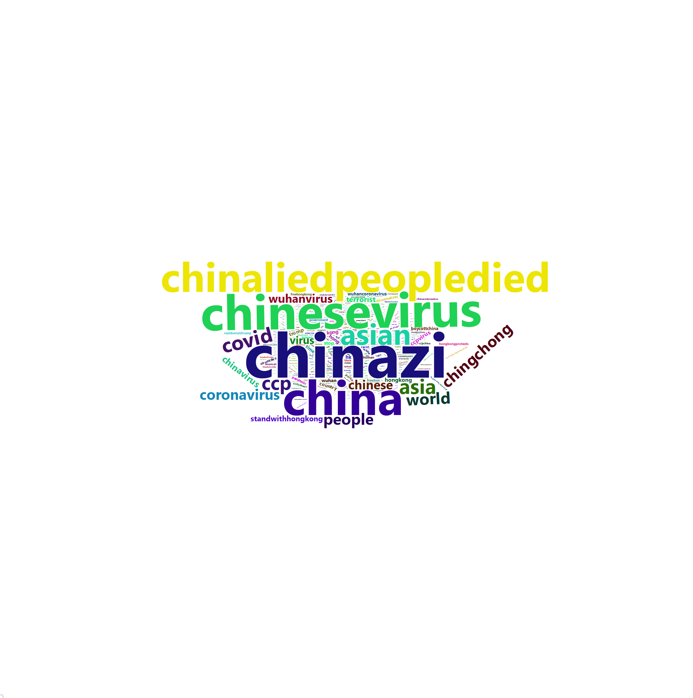

##Data Exploration

```{r include=FALSE, warning=FALSE}
library(NLP)
library(tm)
library(quanteda)
library(tidyverse)
library(stringi)
library(utf8)
library(tidytext)
library(data.table)
library(RColorBrewer)
webshot::install_phantomjs()
library(webshot)
library(rtweet)
library(htmlwidgets)
library(wordcloud)
library(wordcloud2)
library(saotd)
library(RCurl)
library(reshape2)
library(lubridate)

#install.packages("lubridate")
```

First at all the data is loaded as a dataframe called "tweets". The data comes with different encodings, probably according to the location of the twitterer. 

```{r results="hide", message=FALSE, warning=FALSE}
id <- "1Fy2sfSzqGATNu_lICcUds6r9pz-5HL-E"
tweets <- read.csv(sprintf("https://docs.google.com/uc?id=%s&export=download", id))
iconvlist()
```

Encoding the data to UTF-8 allows special characters like ä,ö,ü,ß and similiar. Unfortunately, the data is dirty by URLs, non-english characters, typos and others. The cleaner the data the preciser the analysis. To remove thes URLs the function "removeURL" is applied to the tweets. The text of the tweets are resided in the "text"" colum of the "tweets" data. 

```{r message=FALSE, warning=FALSE}
tweets$text <- stri_encode(tweets$text, "", "UTF-8")

tweetdata <- data.frame(doc_id = tweets$screen_name, text = tweets$text)
corpus <- Corpus(DataframeSource(tweetdata))

#function to remov URLs
removeURL <- content_transformer(function(x) gsub("(f|ht)tp(s?)://\\S+", "", x, perl=T))


corpus <- tm_map(corpus, removeURL)
d <- data.frame(text = sapply(corpus, as.character), stringsAsFactors = F)
tweets$text <- d$text
rm(d)
```

Furthermore, auncapitalization is applied to all tweets and non-alphanumeric, punctation, line breaks, unicode scripted characters and special letters (like á) are rmoved from the tweets, As a result of this some rows contains an empty cell such rows get also deleted. This decreased the dataset by 557 rows, espacially, tweets.

```{r results="hide", message=FALSE, warning=FALSE}
tweets <- as_tibble(tweets)
class(tweets$text)

tweets$text <- tolower(tweets$text)

tweets %>%
  mutate_if(is.factor, as.character) 

tweets$text <- str_replace_all(tweets$text,
                c("[\r\n]" = " ", "[[:punct:]]" = " " , "[^[:alnum:] ]" = " ", "[^a-zA-Z0-9]" = " ", "[\\s[:digit:]]" = " ", "don" = "dont"))

setDT(tweets)
cols_rectified <- names(tweets)[vapply(tweets, is.character, logical(1))]
tweets[,c(cols_rectified) := lapply(.SD, trimws), .SDcols = cols_rectified]
tweets[,c(cols_rectified) := lapply(.SD, function(x)gsub("\\s+", " ", x)), .SDcols = cols_rectified]

empty_char <- tweets %>%
  filter(!str_detect(text, ""))

tweets <- tweets %>%
  anti_join(empty_char, by = "text")

rm(empty_char)
```

In addition, so called stopwords (e.g. "and", "the", "is", and more) can bias the analysis because such words are frequently more used than other words. So the stopwords are removeved via a pre-made list as well as some custom stopwords, espacially, words/shortcuts which are common used on social media such as "lol", "wtf", "idk", "asap", etc. The custom stopwords are not declared in the pre-made list so they are added manually by looking at the data. This reduces the dataframe from approx. 700,000 tokens to approx. 56,835 tokens. Moreover, tokens which occur less than 10 times are not very representive. Based on this these tokens are removed, too, this leads to a final dataframe with 4451 tokens. The first exploration of the adjusted data results in "chinazi", "chinesevirus", "china", "chinaliedpeopledied", "asian", etc. (see graph).

```{r message=FALSE, warning=FALSE}
data("stop_words")

custom_stop_words <- bind_rows(tibble(word = c("de", "na", "pic", "sa", "en", "la", "mga", "ng", "el", "di", "ko", "se", "ka", "ve", "si", "pa", "ll", "ce", "hksos", "lahat", "niyo", "sr", "rus", "pra", "han", "hay", "hoy", "ga", "nah", "pc", "ug", "nya", "cuz", "ta", "ad", "ada", "ini", "xl", "es", "da", "isn", "ni", "le", "al", "lo", "ha", "ya", "ma", "rt", "ba", "fu", "eh", "ur", "aren", "hey", "ncov", "dont", "bc", "dr", "las", "st", "hahaha", "lmao", "mas", "il", "em", "yo", "jo", "ne", "jg", "wwg", "tu", "ny", "des", "deste", "jan", "kay", "ain", "omg", "je", "btw", "idk", "pm", "sb", "ww", "au", "fr", "pla", "aoc", "ca", "nyo", "qu", "ses", "asap", "li", "te", "wala", "kasi", "dude", "ser", "set", "wtf", "ah", "ano", "um", "aka", "bts", "cls", "ja", "lam", "su", "abc", "dito", "vp", "hahahahaha", "haha", "nna", "din", "ke", "po", "ppe", "sir", "doesn", "lol", "xi", "ang", "ako", "mo", "lang", "nga", "kung", "naman", "kaya", "kayo", "pero", "yung", "yan", "twitter", "ban"), 
                                      lexicon = c("custom")), 
                               stop_words)

tweetwords <- tweets %>%
  unnest_tokens(word, text) %>%
  anti_join(custom_stop_words) %>%
  count(word,  sort=T) %>% #56851
  filter(n > 10) #4467 #more or less clean dataset w/ words which occur more than 10 times

# first inspection of top words
tweetwords %>%
  filter(n > 1000) %>%
  mutate(word = reorder(word, n)) %>%
  ggplot(aes(word, n)) +
  geom_col() +
  xlab(NULL) +
  coord_flip() +
  labs(title="Topwords of the Tweets", subtitle="Words which occur more than 1000 times", x="Words",
       y="Wordcount")
```


```{r wordcloudall include=FALSE, fig.height = 11, fig.width = 9, warning=FALSE}
#topwords get displayed in a wordcloud, wordcloud is a .html file on github repo
wcloud <- tweetwords %>%
  anti_join(stop_words) %>%
  filter(n > 100) %>%
  mutate(word = reorder(word, n))

cloud <- wordcloud2(wcloud)
saveWidget(cloud, "wcloud.html", selfcontained = F)
webshot("wcloud.html", "wcloud.png", delay = 5, vwidth = 2000, vheight = 2000)
```


##Analysis

Racial slurs like "chinazi", "chingchong", "chinesevirus", and similar can also be used in an ironic or maybe positve sentiment. So, the general sentiment of these tweets is computed. It shows that the dataset is more negative polarized because there are twice as many negative as positive sentiments (434 negative vs 205 positive). This result is shown in the table and the graph below.

```{r warning=FALSE}
sentiment <- tweetwords %>%
  rename("amount" = "n") %>%
  inner_join(get_sentiments("bing")) %>%
  count(word, amount, sentiment) %>%
  spread(sentiment, n, fill = 0) %>%
  mutate(sentiment = positive - negative) %>%
  arrange(desc(amount))

dplyr::count(sentiment, negative, positive)

```

```{r fig.width=14, fig.height=5, echo=FALSE, warning=FALSE}
sentiment %>%
  filter(amount > 50) %>%
  ggplot(aes(word, sentiment)) +
  geom_col() +
  labs(title="Positive/Negative Sentiments of the Tweets", caption="only tokens which occur more than 50 times are displayed due to illustration reasons",
       y="Negative        Sentiment        Positive", 
       x="Tokens") +
  theme(axis.title.x = element_text(),
        axis.text.x = element_text(color = "black", angle = 90),
        axis.ticks.x = element_blank(),
        axis.title.y = element_text(),
        axis.text.y = element_text(color = "black"),
        axis.ticks.y = element_line()) 
```


```{r include=FALSE, warning=FALSE}
sentiment %>%
  count(word, sentiment, amount) %>%
  acast(word ~ sentiment, value.var = "amount", fill = 0) %>%
  magrittr::set_colnames(c("negative", "positive")) %>%
  comparison.cloud(colors = c("red", "blue"),
                   max.words = 100, random.order = F, 
                   match.colors = T)
```

Furthermore, the aim of this term paper is to analyse a possible change of the racial slurs. So, on the 30th of January the World Health Organization declared the COVID-19 virus as a "Public Health Emergency of International Concern" (WHO 2020). Based on this, the frequency of occurance of the words of this week (26 Jan - 02 Feb 2020) are compared with the frequency of the words of the last week of the dataset (23 - 30 April 2020). Racial slurs ("chingchong", "chinazi", "chinaliedpeopledied", "chinesevirus", etc.) are under the top 20 which can be seen in graphs below. 

```{r results="hide", fig.show="hide", message=FALSE, warning=FALSE}
tweetsweek1 <- tweets %>%
  select(timestamp, text) %>%
  rename("date" = "timestamp", "tweet" = "text") %>%
  mutate(day=day(strptime(date, "%Y-%m-%d %H:%M:%S")) %>% as.character()) %>%
  mutate(month=month(strptime(date, "%Y-%m-%d %H:%M:%S")) %>% as.character()) %>%
  mutate(year=year(strptime(date, "%Y-%m-%d %H:%M:%S")) %>% as.character()) %>%
  arrange(year, month, day) %>%
  unite(newdate, day, month, year, sep = "-", remove = T) %>%
  select(-date) %>%
  rename("date" = "newdate") %>%
  mutate(date = as.Date(date, "%d-%m-%Y")) %>%
  filter(date >= "2020-1-26" & date <= "2020-2-02")


tweetsweek2 <- tweets %>%
  select(timestamp, text) %>%
  rename("date" = "timestamp", "tweet" = "text") %>%
  mutate(day=day(strptime(date, "%Y-%m-%d %H:%M:%S")) %>% as.character()) %>%
  mutate(month=month(strptime(date, "%Y-%m-%d %H:%M:%S")) %>% as.character()) %>%
  mutate(year=year(strptime(date, "%Y-%m-%d %H:%M:%S")) %>% as.character()) %>%
  arrange(year, month, day) %>%
  unite(newdate, day, month, year, sep = "-", remove = T) %>%
  select(-date) %>%
  rename("date" = "newdate") %>%
  mutate(date = as.Date(date, "%d-%m-%Y")) %>%
  filter(date >= "2020-4-23" & date <= "2020-4-30")
```
```{r}
week1occur <- tweetsweek1 %>%
  unnest_tokens(word, tweet) %>%
  anti_join(custom_stop_words) %>%
  count(word,  sort=T) %>%
  top_n(20)

week2occur <- tweetsweek2 %>%
  unnest_tokens(word, tweet) %>%
  anti_join(custom_stop_words) %>%
  count(word,  sort=T) %>%
  top_n(20)


weekwordsoccur <- week1occur %>%
  bind_rows(week2occur) %>%
  mutate(week = case_when(n == 619 | n == 295 | n == 201 | n == 166 | n == 162 | n == 146 | n == 139 | n == 132 | n == 97 | n == 89 | n == 58 |
                          n == 47 | n == 41 | n == 36 | n == 35 | n == 31 | n == 30 | n == 28  ~ "Week Jan/Feb",
                          n == 1590 | n == 1005 | n == 974 | n == 590 | n == 495 | n == 433 | n == 309 | n == 278 | n == 272 | n == 212 | n == 202 | n == 189 |
                          n == 187 | n == 169 | n == 165 | n == 156 | n == 151 | n == 141 | n == 126 | n == 116 ~ "Week April"))

weekwordsoccur %>%
  select(word, n, week) %>%
  mutate(word = reorder(word, n)) %>%
  ggplot(aes(word, n, fill = week)) +
  geom_col(show.legend = F) +
  facet_wrap(~week, scales = "free_y") +
  labs(title = "Topwords Occurance",
       subtitle = "26 Jan - 02 Feb 2020 and 23 April - 30 April 2020",
       y="Token Occurance", 
       x=NULL) +
  coord_flip()
```

Therefore the "raw" count of words (=tokens) is not very representive because it was not equally tweetet in these weeks. This can seen by the dataframe observation of "tweetsweek1" (1443 Tweets) and "tweetsweek2" (3533). The week of April contains more than twice as many tweets as the week of January. 
To analyse the possible change of racial slurs on Twitter during the coronavirus we compare the frequency in percent of the top 20 words. To calculate this frequency the occurance of each word is counted and divided by the total sum of all occuraces of the week and multiplied by 100 to get the percentage value.

```{r fig.show="hide", message=FALSE, warning=FALSE}
tweetsweek1 %>%
  unnest_tokens(word, tweet) %>%
  anti_join(custom_stop_words) %>%
  count(word,  sort=T) %>%
  top_n(20) %>%
  summarise(total = sum(n)) #2416
```
```{r fig.show="hide", message=FALSE, warning=FALSE}
tweetsweek2 %>%
  unnest_tokens(word, tweet) %>%
  anti_join(custom_stop_words) %>%
  count(word,  sort=T) %>%
  top_n(20) %>%
  summarise(total = sum(n))   #7760
```


```{r message=FALSE, warning=FALSE}
week1words <- tweetsweek1 %>%
  unnest_tokens(word, tweet) %>%
  anti_join(custom_stop_words) %>%
  count(word,  sort=T) %>%
  top_n(20) %>%
  mutate(freq = (n/2416)*100)

week2words <- tweetsweek2 %>%
  unnest_tokens(word, tweet) %>%
  anti_join(custom_stop_words) %>%
  count(word,  sort=T) %>%
  top_n(20) %>%
  mutate(freq = (n/7760)*100)

weekwords <- week1words %>%
  bind_rows(week2words) %>%
  mutate(week = case_when(n == 619 | n == 295 | n == 201 | n == 166 | n == 162 | n == 146 | n == 139 | n == 132 | n == 97 | n == 89 | n == 58 |
                          n == 47 | n == 41 | n == 36 | n == 35 | n == 31 | n == 30 | n == 28  ~ "Week Jan/Feb",
                          n == 1590 | n == 1005 | n == 974 | n == 590 | n == 495 | n == 433 | n == 309 | n == 278 | n == 272 | n == 212 | n == 202 | n == 189 |
                          n == 187 | n == 169 | n == 165 | n == 156 | n == 151 | n == 141 | n == 126 | n == 116 ~ "Week April"))
  
weekwords %>%
  select(word, freq, week) %>%
  mutate(word = reorder(word, freq)) %>%
  ggplot(aes(word, freq, fill = week)) +
  geom_col(show.legend = F) +
  facet_wrap(~week, scales = "free_y") +
  labs(title = "Topwords Occurance",
       subtitle = "26 Jan - 02 Feb 2020 and 23 April - 30 April 2020",
       y="Token Frequence in %", 
       x=NULL) +
  coord_flip()
```


```{r wordcloud, message=FALSE, warning=FALSE}
wc_week1 <- week1words %>%
  mutate(word = reorder(word, n)) %>%
  mutate_if(is.factor, as.character)

cloud1 <- wordcloud2(wc_week1, size = 2)
saveWidget(cloud1, "wcloud_week1.html", selfcontained = F)
webshot("wcloud_week1.html", "wc_week1.png", delay = 5, vwidth = 2000, vheight = 2000)

wc_week2 <- week2words %>%
  mutate(word = reorder(word, n)) %>%
  mutate_if(is.factor, as.character)

cloud2 <- wordcloud2(wc_week2)
saveWidget(cloud2, "wcloud_week2.html", selfcontained = F)
webshot("wcloud_week2.html", "wc_week2.png", delay = 5, vwidth = 2000, vheight = 2000)
```


